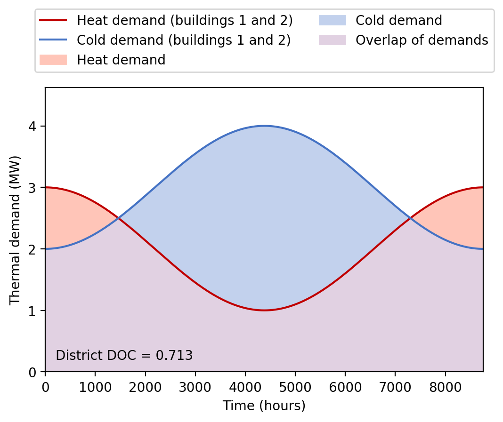

# Demand Overlap Coefficient (DOC)
This repository contains code for the exemplary calculation of the Demand Overlap Coefficient (DOC) as presented in

**M. Wirtz, L. Kivilip, P. Remmen, D. Müller: Quantifying Demand Balancing in Bidirectional Low Temperature Networks. Energy and Buildings, 224, 110245, 2020.
[https://doi.org/10.1016/j.enbuild.2020.110245](https://doi.org/10.1016/j.enbuild.2020.110245)**

If you have any questions, feel free to contact [marco.wirtz@eonerc.rwth-aachen.de](mailto:marco.wirtz@eonerc.rwth-aachen.de).

## What is the Demand Overlap Coefficient?
The Demand Overlap Coefficient (DOC) is a metric to quantify the waste heat potential in districts based on heating and cooling demand profiles. Since the efficiency of bidirectional low temperature networks (also called 5th generation district heating and cooling networks, 5GDHC) strongly depends on heating and cooling demands of the connected buildings, the DOC is a metric to estimate if a 5GDHC network is suited for a certain district or not. The DOC serves as a practical metric in the planning process of 5GDHC networks in order to identify and assemble building clusters with complementary demand profiles.

The script ´´´run_DOC_calculation.py´´´ in this repository creates the figure below. It shows the cumulated heating and cooling demand profiles of two exemplary buildings: Red for heating, blue for cooling. The DOC quantifies the overlap of both demand profiles. The overlap is colored in purple.

### Required python packages
 - Numpy 
 - Matplotlib (for illustration only) 

### License
The code in this repository is license-free (anyone is free to copy, modify, publish, use, compile, sell, or distribute the code, for any purpose, commercial or non-commercial, and by any means.)

#### Acknowledgements
The  research study was  supported  by  the  Helmholtz  Association  under  the  Joint  Initiative  “Energy System 2050 – A Contribution of the Research Field Energy”.